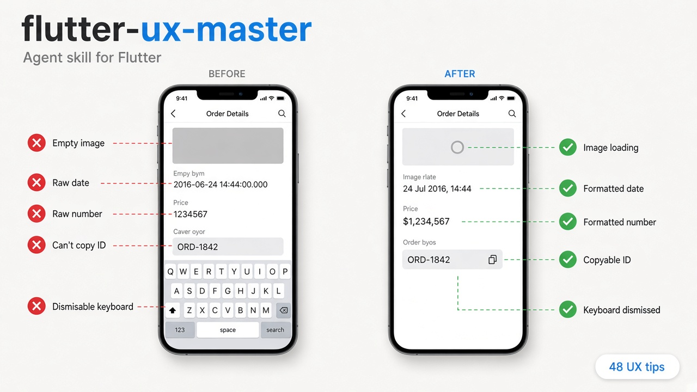

# flutter-ux-master

Your Flutter UX companion - it watches for the easy-to-miss details (empty/error/loading states, keyboard, tap targets, haptics, native polish), reports them, and you pick what to fix.

## Installation

To install this skill into your project, run the following command. The `--agent universal` flag puts it in the standard `.agents/skills` folder that most agents use.

```bash
npx skills add EmadBeltaje/flutter-ux-master --agent universal --yes
```

## Updating Skills

To update, run the following command:

```bash
npx skills update
```

## How it works

**Watch** - you name the skill while building a screen. It finishes that work without catalog edits, then audits what shipped, then reports.

**Review** - you ask it to audit, review, or polish existing code. Same end state: report, then wait.

You pick which violations to fix, or say fix everything after seeing the list. Fixes follow the project’s own widgets and state management.

## How to prompt

```
/flutter-ux-master audit the UX before launch
/flutter-ux-master polish this screen
/flutter-ux-master check empty, error, and loading states
/flutter-ux-master check my forms
/flutter-ux-master add haptics
```

Rules live in [`skills/flutter-ux-master/references/`](skills/flutter-ux-master/references/).

## Author

[EmadBeltaje](https://github.com/EmadBeltaje)
